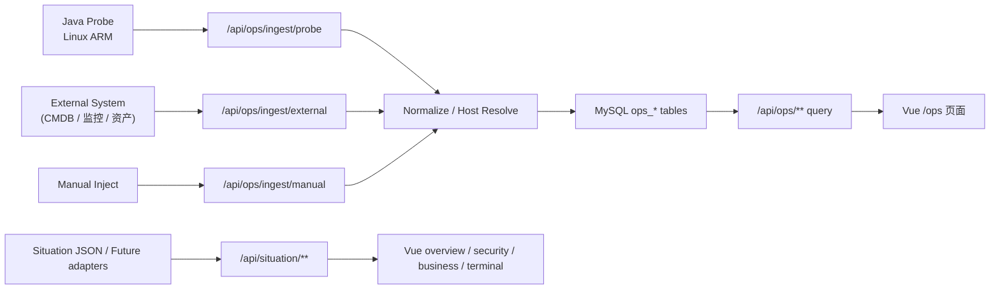

# 架构说明（多域态势 + 多源接入）

## 1. 总体架构

系统采用前后端分离结构：

- `frontend/`：综合、安全、业务、终端、运维五类态势展示
- `backend/`：统一 API、运维态势域、主题态势占位域
- `probe/`：Linux ARM Java 探针
- `mysql`：结构化存储与快照留存

## 2. 领域拆分

### 2.1 `/api/ops/**` 真实运维域

定位：

- 承接真实基础设施数据
- 完成主机归一、快照沉淀、告警计算、来源健康计算
- 为 `/ops` 页面提供真实联调能力

内部按四层组织：

- `ingest`
- `normalize`
- `domain`
- `query`

### 2.2 `/api/situation/**` 主题态势占位域

定位：

- 支撑综合 / 安全 / 业务 / 终端四类主题态势页面
- 当前先提供统一 DTO 与稳定接口契约
- 后续逐步替换为真实外部数据源编排

当前数据载体：

- `backend/src/main/resources/mock/situations.json`

设计原则：

- 不让前端直接绑死 mock 文件结构
- 不让四个页面各自维护零散 DTO
- 用统一 `SituationPageDto + SituationSectionDto` 表达多类页面布局与内容

### 2.3 终端域人员主数据约束

在终端态势场景中，零信任客户端会上报 `手机号` 等移动设备身份字段。为避免把手机号直接当作人员主键，系统先固定以下建模原则：

- `person_profile`：统一维护人员主数据
- `person_phone`：维护手机号与人员映射关系
- 终端侧 `phoneNumber` 仅作为人员归一线索，不直接替代人员主记录

这样做的目的：

- 支持一人多终端 / 一人多号码扩展
- 支持未来接入 HR、AD、CMDB、零信任平台的人员主数据
- 让终端态势能够按人员、部门、岗位做聚合，而不是只按设备散点展示

详见：`/Users/bingham/Documents/Project/业务安全态势系统_项目资料/docs/terminal-data-model.md`

## 3. 运维域接入策略

探针不是唯一入口，只是第一种 `source adapter`。

首期支持：

- `PROBE`
- `EXTERNAL_API`
- `MANUAL_IMPORT`

所有来源最终都写入统一 `ops_*` 表，前端不再按各来源原始格式分别取数。

## 3.1 灵活接入 Envelope 设计

考虑到外部系统协议尚未收敛，运维接入层采用 **稳定主干字段 + 可扩展 envelope** 的建模方式：

- 主干字段：`sourceType / sourceSystem / requestId / externalAssetId / schemaVersion / payloadType / observedAt`
- 业务对象：`host / snapshot / networkInterfaces / processes`
- 扩展容器：`labels / attributes / metrics / extensions`

这样做的目的不是把原始上游格式直接暴露给前端，而是让不同来源在接入层“尽量少改造即可接入”，最终仍统一落库到 `ops_host / ops_host_snapshot / ops_process_snapshot / ops_netif_snapshot`。

一期的约束如下：

- `PROBE` 依然采用严格字段校验，保证真实探针链路质量
- `EXTERNAL_API` / `MANUAL_IMPORT` 允许部分字段缺失，由后端做归一补全
- 前端 `/ops` 永远只读统一查询接口，不按来源消费原始 payload

## 4. 主机归一策略

采用双标识并存：

- 内部：`host_code`
- 外部：`external_asset_id`

归一逻辑：

1. 若存在 `source_system + external_asset_id` 绑定，优先命中绑定
2. 否则按 `host_code` 查找内部主机
3. 若都不存在，则创建新主机
4. 若外部资产 ID 后续补齐，仅需新增/更新绑定关系

## 5. 主机状态与来源状态

### 主机状态

基于 `observed_at` 与采样周期计算：

- 2 个采样周期未更新：`STALE`
- 5 个采样周期未更新：`OFFLINE`
- 其余：`ONLINE`

### 来源状态

基于最近一次 ingest 事件推导：

- enabled=false：`DISABLED`
- 最近状态在线：`HEALTHY`
- 最近状态陈旧：`DEGRADED`
- 最近状态离线：`OFFLINE`
- 无事件：`UNKNOWN`

## 6. 前端主题态势工程化策略

综合 / 安全 / 业务 / 终端页面共享同一套前端能力：

- route-level view 保持轻量，仅负责路由页装配
- 视图逻辑集中在 `useSituationPage`
- 各 section 组件只负责单一版块展现与事件抛出
- 数据策略为：**integration 优先，mock 仅作故障回退**

当前已支持的交互：

- 板块过滤 chips
- 数据来源 pill
- warning banner
- 焦点详情面板
- 空态 / 加载态 / 错误态

## 7. Probe 闭环

Probe 负责：

- 读取 `/proc`
- 生成稳定 `host_code`
- 周期采集系统指标
- 推送到后端
- 后端不可达时 spool 缓冲
- 恢复后自动补报

Probe 不直接写业务数据库，也不参与前端逻辑。
