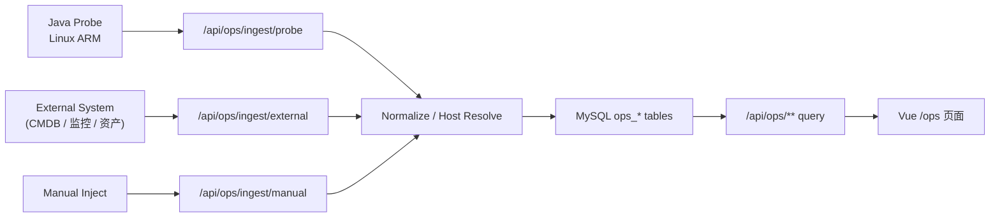

# 架构说明（多源接入运维态势域）

## 1. 总体架构

系统采用前后端分离结构：

- `frontend/`：面向运营、安全、运维的态势展示
- `backend/`：统一 API 与运维态势域
- `probe/`：Linux ARM Java 探针
- `mysql`：结构化存储与快照留存

## 2. 运维域分层

### ingest

负责处理多来源入站：

- probe 主动上报
- external 占位推送
- manual 测试注入

### normalize

统一转换不同来源的数据结构：

- 统一主机模型
- 统一快照模型
- 统一来源模型
- 统一告警模型

### domain

维护核心运维实体：

- 主机
- 绑定
- 快照
- 进程
- 告警
- 来源

### query

为 `/ops` 页面提供聚合查询：

- 总览
- 主机列表
- 主机详情
- 趋势曲线
- 告警
- 来源健康度

## 3. 多源接入策略

探针不是唯一入口，只是第一种 `source adapter`。

首期支持：

- `PROBE`
- `EXTERNAL_API`
- `MANUAL_IMPORT`

所有来源最终都写入统一 `ops_*` 表，前端不再按各来源原始格式分别取数。

## 4. 主机归一策略

采用双标识并存：

- 内部：`host_code`
- 外部：`external_asset_id`

归一逻辑：

1. 若存在 `source_system + external_asset_id` 绑定，优先命中绑定
2. 否则按 `host_code` 查找内部主机
3. 若都不存在，则创建新主机
4. 若外部资产 ID 后续补齐，仅需新增/更新绑定关系

## 5. 主机状态与来源状态

### 主机状态

基于 `observed_at` 与采样周期计算：

- 2 个采样周期未更新：`STALE`
- 5 个采样周期未更新：`OFFLINE`
- 其余：`ONLINE`

### 来源状态

基于最近一次 ingest 事件推导：

- enabled=false：`DISABLED`
- 最近状态在线：`HEALTHY`
- 最近状态陈旧：`DEGRADED`
- 最近状态离线：`OFFLINE`
- 无事件：`UNKNOWN`

## 6. Probe 闭环

Probe 负责：

- 读取 `/proc`
- 生成稳定 `host_code`
- 周期采集系统指标
- 推送到后端
- 后端不可达时 spool 缓冲
- 恢复后自动补报

Probe 不直接写业务数据库，也不参与前端逻辑。
